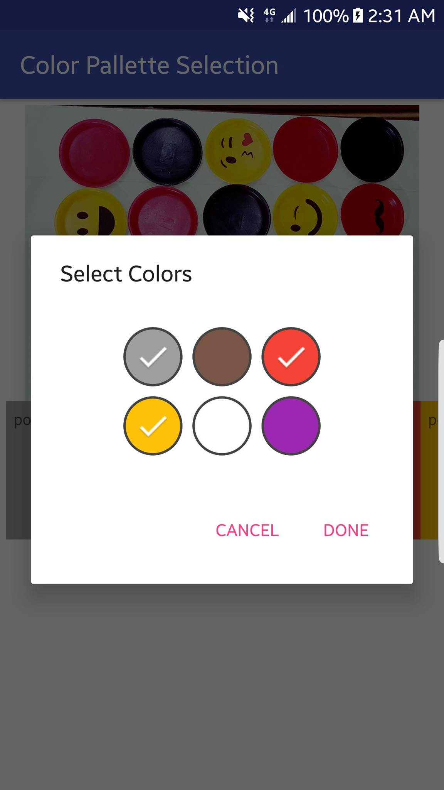
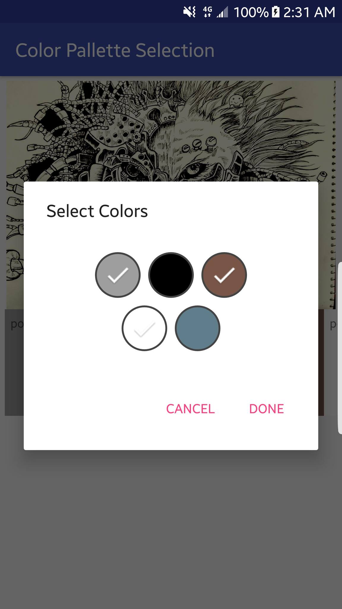

Color Picker Dialog 
===================
ColorPickerDialog is an Android Library providing color picker dialog for single color or multi color selection from the ArrayList of colors provided by developer.


Screenshots
-----------
 

Usage
-----
* 1. Opening Single Selection ColorPicker

```java
ColorPickerDialog dialog = ColorPickerDialog.newInstance(
                            ColorPickerDialog.SELECTION_SINGLE,
                            closestColorsList,
                            3, // Number of columns
                            ColorPickerDialog.SIZE_SMALL);
                
dialog.show(getFragmentManager(), "some_tag");   
 ```
 
* 2. Opening Multi Selection ColorPicker

```java
ColorPickerDialog dialog = ColorPickerDialog.newInstance(
                ColorPickerDialog.SELECTION_MULTI,
                closestColorsList,
                3, // Number of columns
                ColorPickerDialog.SIZE_SMALL);

dialog.show(getFragmentManager(), "some_tag");
```

* Dialog OnClick Listener

```java
dialog.setOnDialodButtonListener(new ColorPickerDialog.OnDialogButtonListener() {
            @Override
            public void onDonePressed(ArrayList<Integer> mSelectedColors) {
                Log.d("selected colors", mSelectedColors.size() + " ");
            }
            @Override
            public void onDismiss() {
            }
        });
 ``` 
 
 Import ColorPickerDialog dependency
------------------------------------

declare it into your pom.xml

```xml
<dependency>
  <groupId>ColorPalletteSelection</groupId>
  <artifactId>colorpickerdialog</artifactId>
  <version>1.0.1</version>
  <type>pom</type>
</dependency>
```
or into your build.gradle

```groovy
dependencies {
    compile 'ColorPalletteSelection:colorpickerdialog:1.0.1'
}
```
